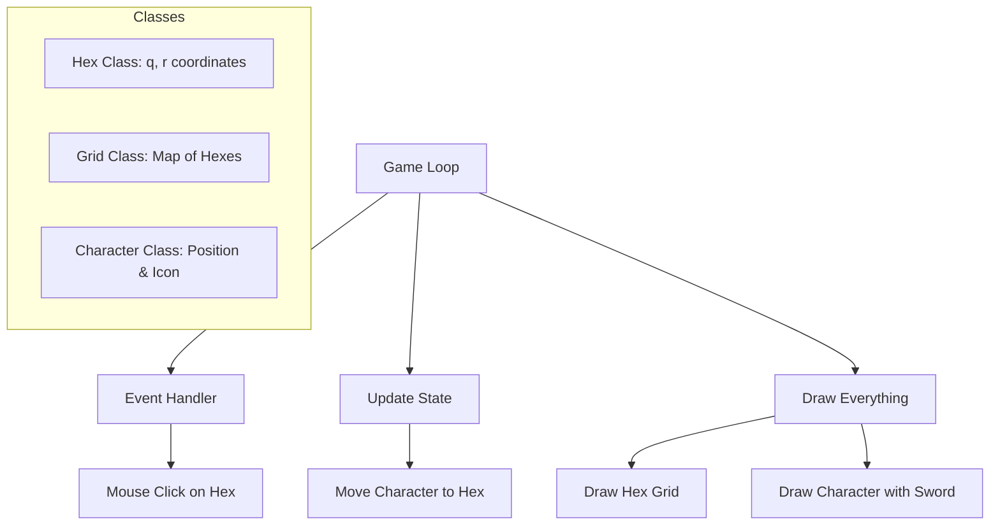

# Project Plan: Hex-Jump Pygame

Basic prototype featuring hexagonal tiles and a character jumping between them.

## 1. Technical Requirements
- Pygame (`pip install pygame`)
- Flat-top hexagon orientation
- Character: Circle with a sword icon

## 2. Architecture

## 3. Files
- `main.py`: Entry point and main game loop.
- `requirements.txt`: Project dependencies.

## 4. Execution Plan
1. Create `requirements.txt` with `pygame`.
2. Create `main.py` containing:
   - Screen setup.
   - `Hex` class (axial coordinates).
   - Coordinate conversion functions (Hex to Screen).
   - `Character` class with custom drawing.
   - Logic for finding the clicked hex.
   - Jump animation (interpolation).
